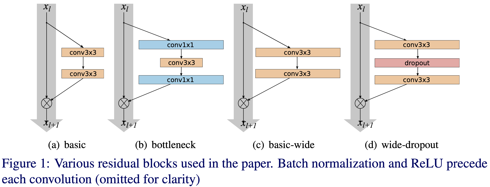

[TensorFlow 2] Wide Residual Networks
=====

## Related Repositories
<a href="https://github.com/YeongHyeon/ResNet-TF2">ResNet-TF2</a>  
<a href="https://github.com/YeongHyeon/ResNeXt-TF2">ResNeXt-TF2</a>  

## Concept
<div align="center">
    
  <p>Concept of Wide ResNet [1].</p>
</div>

## Performance

|Indicator|Value|
|:---|:---:|
|Accuracy|0.99350|
|Precision|0.99353|
|Recall|0.99343|
|F1-Score|0.99347|

```
Confusion Matrix
[[ 979    0    0    0    0    0    1    0    0    0]
 [   0 1130    0    1    1    0    1    2    0    0]
 [   0    1 1028    1    0    0    0    1    0    1]
 [   0    0    1 1008    0    1    0    0    0    0]
 [   0    0    1    0  978    0    1    0    0    2]
 [   1    0    0    5    0  884    1    0    0    1]
 [   1    2    0    0    1    1  953    0    0    0]
 [   0    1    5    0    0    0    0 1021    1    0]
 [   5    0    4    3    1    0    1    1  957    2]
 [   0    0    2    0    4    3    0    3    0  997]]
Class-0 | Precision: 0.99290, Recall: 0.99898, F1-Score: 0.99593
Class-1 | Precision: 0.99647, Recall: 0.99559, F1-Score: 0.99603
Class-2 | Precision: 0.98751, Recall: 0.99612, F1-Score: 0.99180
Class-3 | Precision: 0.99018, Recall: 0.99802, F1-Score: 0.99408
Class-4 | Precision: 0.99289, Recall: 0.99593, F1-Score: 0.99441
Class-5 | Precision: 0.99438, Recall: 0.99103, F1-Score: 0.99270
Class-6 | Precision: 0.99478, Recall: 0.99478, F1-Score: 0.99478
Class-7 | Precision: 0.99319, Recall: 0.99319, F1-Score: 0.99319
Class-8 | Precision: 0.99896, Recall: 0.98255, F1-Score: 0.99068
Class-9 | Precision: 0.99402, Recall: 0.98811, F1-Score: 0.99105

Total | Accuracy: 0.99350, Precision: 0.99353, Recall: 0.99343, F1-Score: 0.99347
```

## Requirements
* Python 3.7.6  
* Tensorflow 2.1.0  
* Numpy 1.18.1  
* Matplotlib 3.1.3  

## Reference
[1] Sergey Zagoruyko et al. (2016). <a href="https://arxiv.org/abs/1605.07146">Wide Residual Networks</a>. arXiv preprint arXiv:1605.07146.
